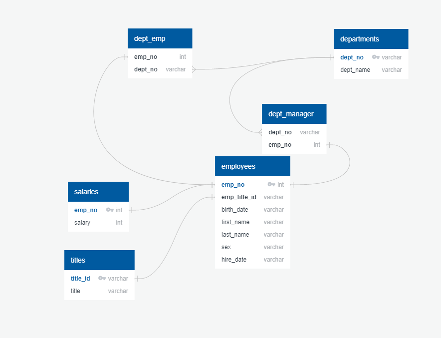

# SQL Homework - Employee Database

### Data Engineering

* For the data engineering portion of this assignment, I examined the accompanying csv's in detail to create an Entity Relationship Diagram (ERD), pictured above.
* Although the [Quick Database Diagrams](http://www.quickdatabasediagrams.com) web application does allow you to export your ERD into a PostgreSQL table schema, it did so with multiple errors. I fixed those errors when creating my final PostgreSQL schema.
* Finally, I imported the csv's into pgAdmin.

### Data Analysis

My queries.sql file answers the following questions outlined in the assignment instructions:
1. List the following details of each employee: employee number, last name, first name, sex, and salary.
2. List first name, last name, and hire date for employees who were hired in 1986.
3. List the manager of each department with the following information: department number, department name, the manager's employee number, last name, first name.
4. List the department of each employee with the following information: employee number, last name, first name, and department name.
5. List first name, last name, and sex for employees whose first name is "Hercules" and last names begin with "B."
6. List all employees in the Sales department, including their employee number, last name, first name, and department name.
7. List all employees in the Sales and Development departments, including their employee number, last name, first name, and department name.
8. In descending order, list the frequency count of employee last names, i.e., how many employees share each last name.
